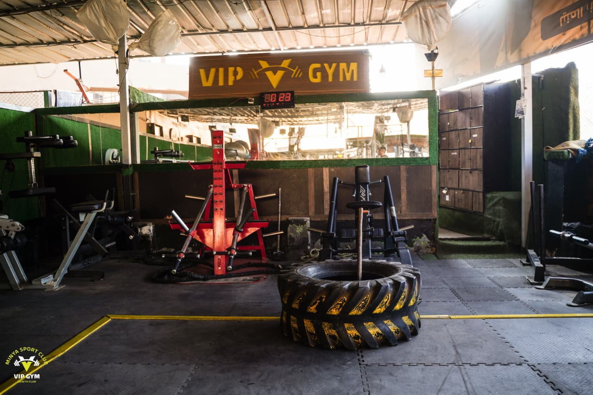
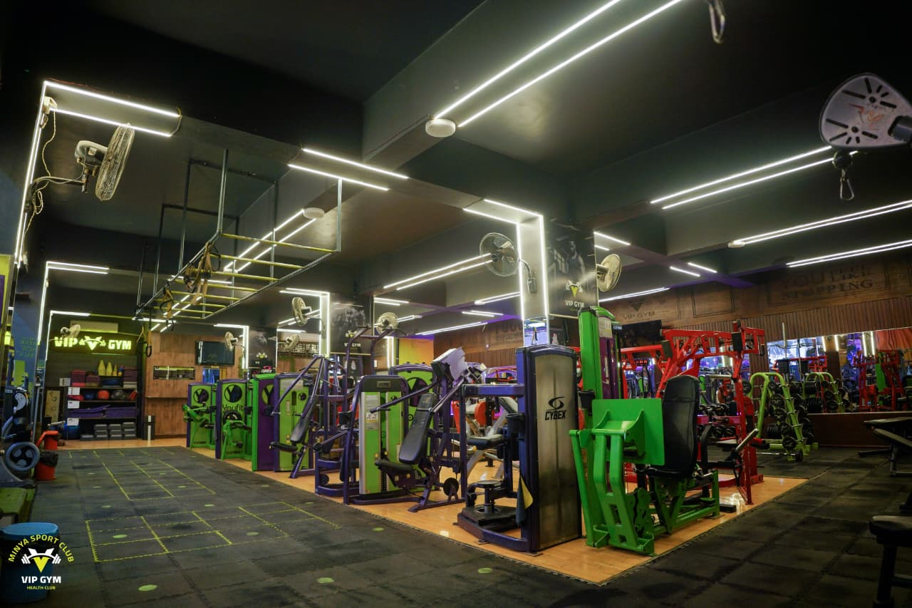
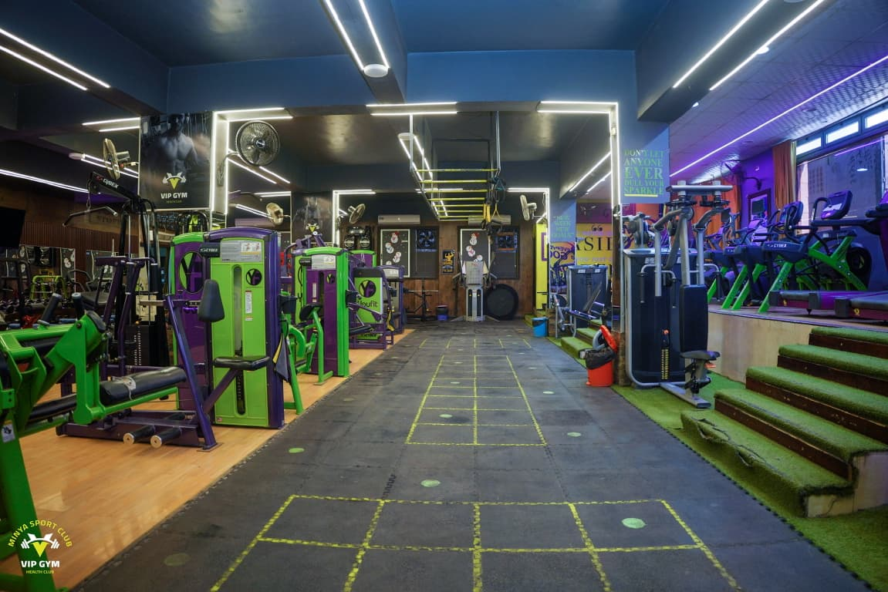
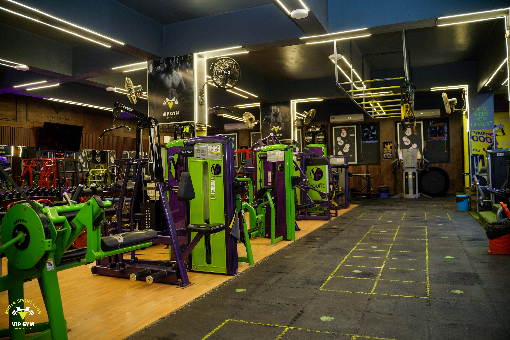
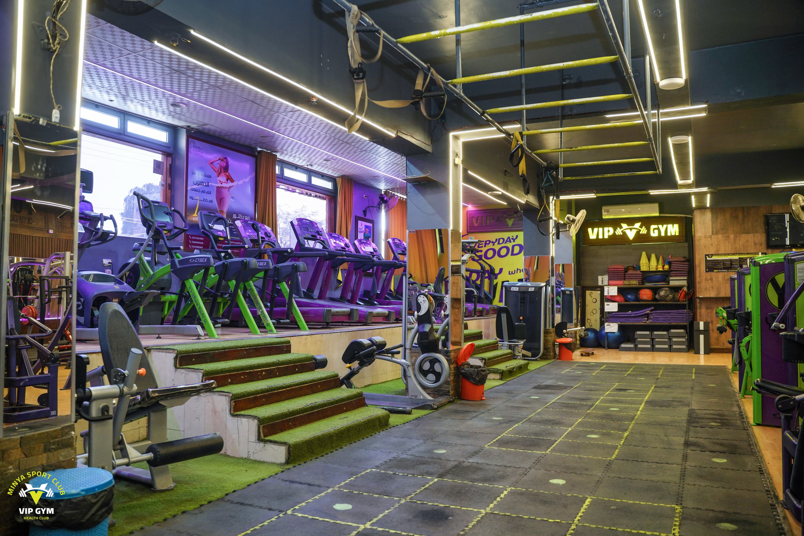

# 🏆 VIP GYM Minya

> **The Ultimate Elite Fitness Experience in Minya Sports Club**
> 
> Official landing page for **VIP GYM**, featuring state-of-the-art CYBEX American equipment, premium panoramic views, expert military qualification training, and healthy nutritional services.

---

## 📸 Gym Gallery & Facilities (معرض الصور)

VIP GYM is equipped with premium American fitness machinery and provides an outstanding environment for training. Here are some of our elite facilities:

<p align="center">
  
  
</p>

<p align="center">
  
  
  
</p>

---

## ✨ Features (أبرز المميزات)

### 🎖️ Military Qualification & Preparation (التأهيل العسكري)
A specialized module crafted for cadets wishing to join the Egyptian Military Academies and Police Academy. It includes:
* **Dynamic Countdown Timer**: A fully responsive real-time timer counting down to the kickoff of the **2026 Academy Registrations**.
* **Success Wall of Honor (لوحة الشرف)**: A spectacular interactive **Hexagonal Cadet Grid** displaying successful graduates who joined the military forces, honoring their hard work.
* **Direct WhatsApp Reservation**: Quick links to secure early coaching spots.

<p align="center">
  
  
</p>

---

### 🥗 Healthy Gym Buffet (البوفيه الرياضي)
An interactive menu featuring customizable high-protein healthy meals, freshly squeezed juices, and advanced protein shakes designed to boost muscle recovery and performance.
* **Filter Tabs**: Toggle between **Meals (وجبات)**, **Healthy Drinks (مشروبات)**, and **Protein Shakes (مخفوق البروتين)**.
* **Dynamic Calculations**: Highlights calorie counts and nutritional breakdowns for each item.

---

### 🏋️ Elite Personal Trainers (المدربين المحترفين)
Our world-class certified coaches are ready to design custom workout programs matching your physique.
* **Men/Women Subsections**: Toggle between the Men's Coaching Staff and Women's Coaching Staff.
* **Interactive Profiles**: Detail-rich cards displaying experience, certifications, specialties, and contact options.

---

## 🛠️ Tech Stack & Architecture

This application is built with modern frontend technologies designed for lightning-fast loading speeds, high fluid responsiveness, and eye-catching animations.

* **Framework**: React 18+ (TypeScript)
* **Build Tool**: Vite
* **Styling**: Tailwind CSS
* **Animations**: Motion (f.k.a. Framer Motion) from `motion/react`
* **Icons**: Lucide React

---

## 🚀 Getting Started

### Prerequisites
Make sure you have [Node.js](https://nodejs.org/) installed on your machine.

### Installation
1. Clone the repository or extract the source files.
2. Install the project dependencies:
   ```bash
   npm install
   ```

### Running in Development
To boot up the local development server:
```bash
npm run dev
```
Open your browser and navigate to `http://localhost:3000`.

### Building for Production
To bundle and optimize the application for production deployment:
```bash
npm run build
```
The static compiled files will be generated in the `dist/` directory, ready to be served by any CDN or static server.

---

## 🤝 Contact & Subscriptions
For memberships, personal training inquiries, and military cadet reservations, contact us directly or visit us inside **Minya Sports Club (نادي المنيا الرياضي)**.

* **📍 Address**: نادي المنيا الرياضي، المنيا، مصر.
* **📞 WhatsApp Support**: +201007555737

---

<p align="center">
  
</p>
